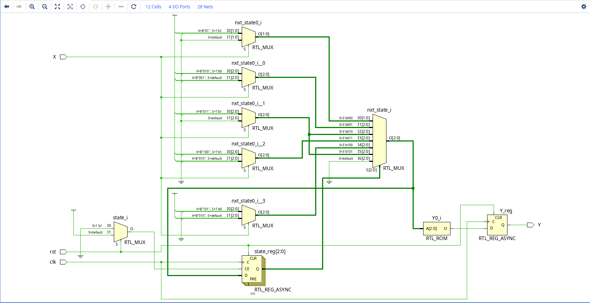
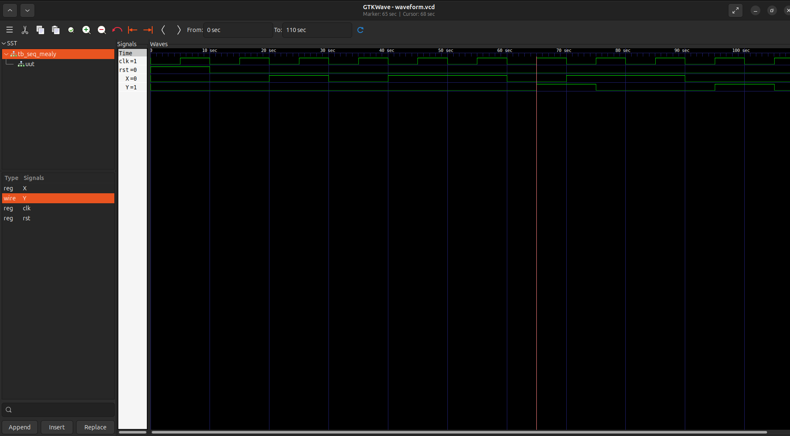

# Sequence Detector (Mealy FSM)

## 📌 Overview
This project implements a **Mealy-type Sequence Detector** in **Verilog HDL**.  
It detects a specific sequence of bits in a serial input stream and outputs `Y=1` when the sequence is found. The design is tested using **Icarus Verilog (`iverilog`)** and visualized with **GTKWave**.

---

## 📜 Features
✔ **Mealy State Machine** (Output depends on both current state and input)  
✔ **Overlapping Pattern Detection** (Handles cases where part of a detected sequence is part of the next)  
✔ **Clock and Reset Control**  
✔ **Testbench for Simulation**  
✔ **Waveform Analysis using GTKWave**  

---

## 🎯 Sequence to Detect
The sequence detector is designed to detect **"10110"** (5-bit sequence).  
- The output `Y` becomes `1` when this sequence is detected.
- Supports **overlapping cases** (e.g., "1011010" still detects two valid sequences).

---

## 🛠 Schematic 
The following schematic was **automatically generated using Vivado** and represents the **circuit structure of the Mealy FSM**:

- This schematic shows the **registers, logic gates, and state transitions** in the design.
- It provides a **visual representation of how the sequence detector operates** in hardware.

---

## 📊 Simulation Output
The following image shows the waveform output when detecting the sequence `"10110"`:

- The **X signal** represents the input sequence.
- The **Y signal** goes HIGH (`1`) when the sequence **"10110"** is detected.
- Overlapping sequences are correctly detected.

---